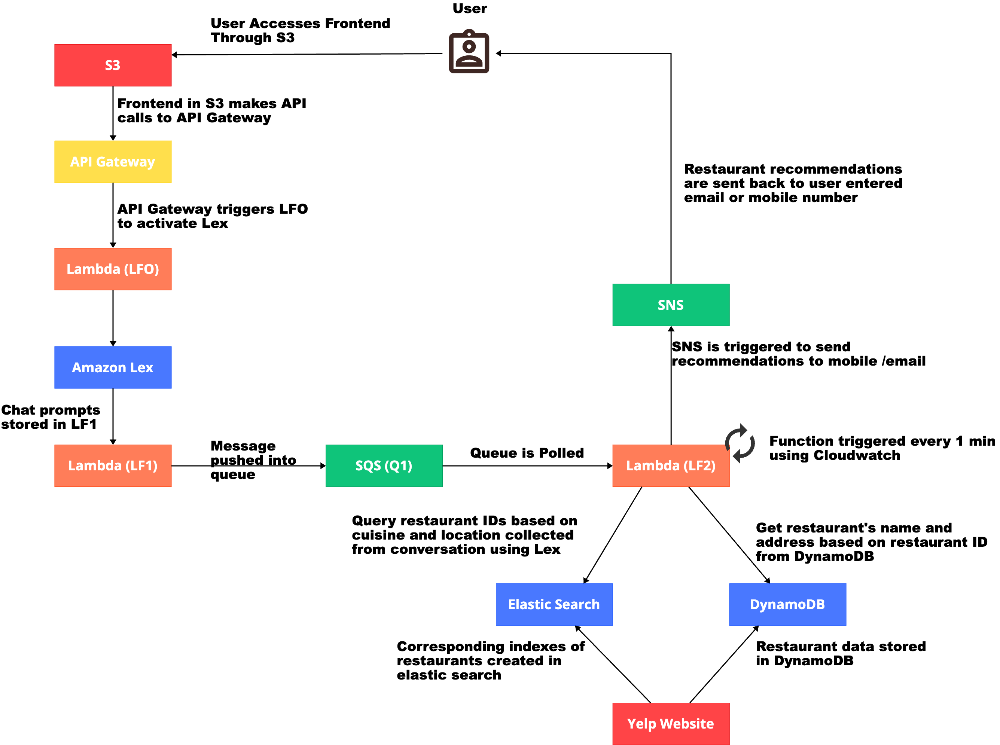

# DiningConcierge

Dining Concierge is a lex chatbot that can recommend restaurants for the user through conversation.
The bot collects information such as Cuisine, No.of guests, Time, Location and Phone number.
Based on these inputs, it searches for restaurants with the given cuisine from OpenSearch and DynamoDB and sends these suggestions to the user's phone number. 

## The architecture diagram of the application is as follows.

